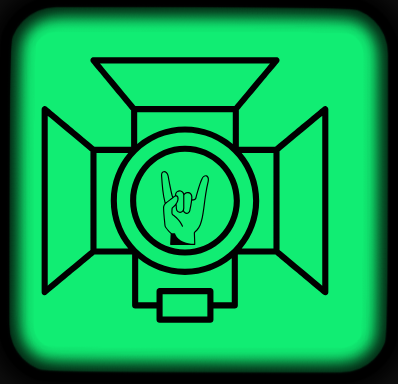
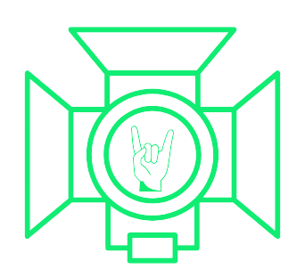
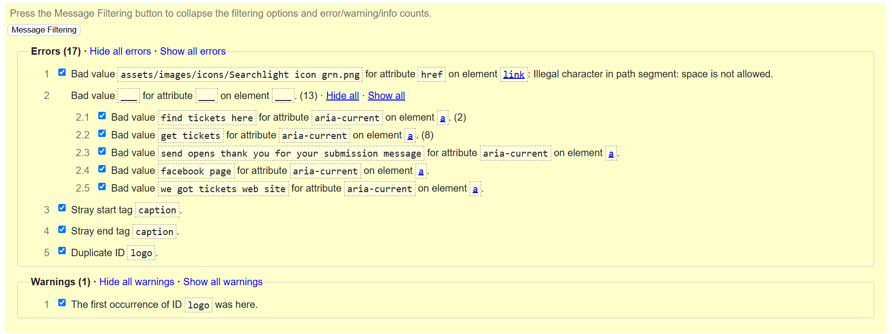
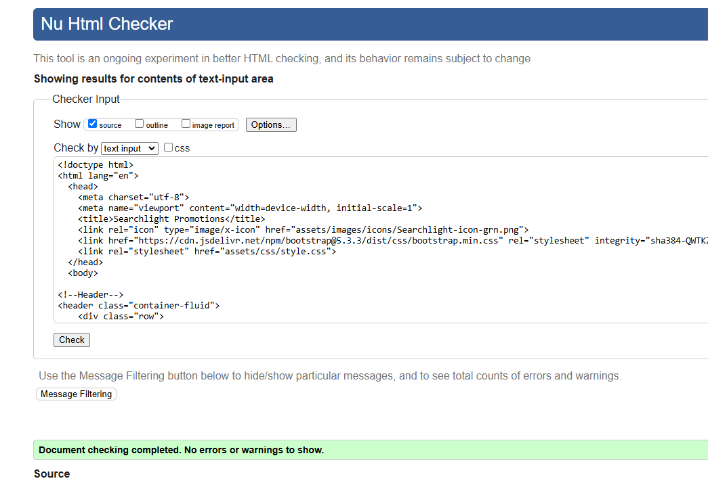
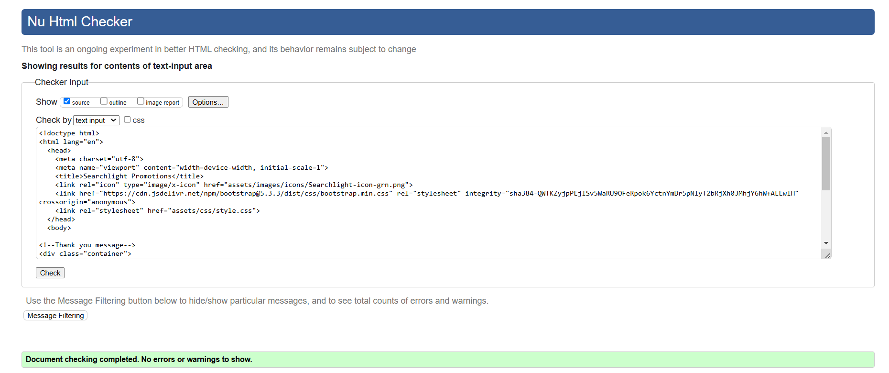
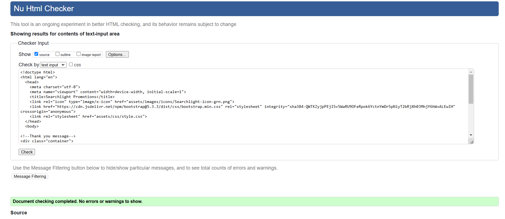
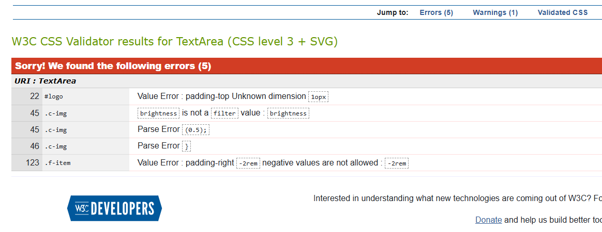
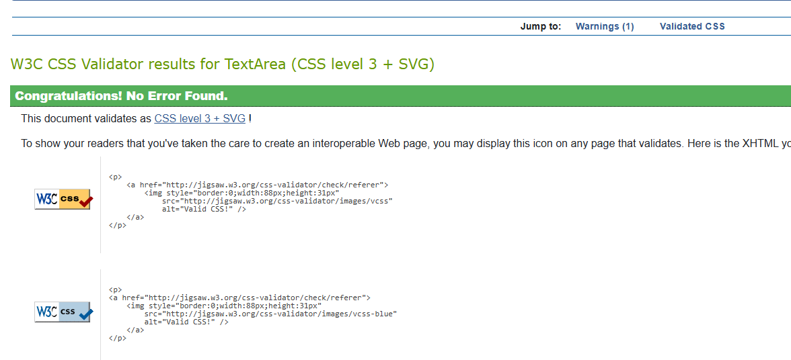
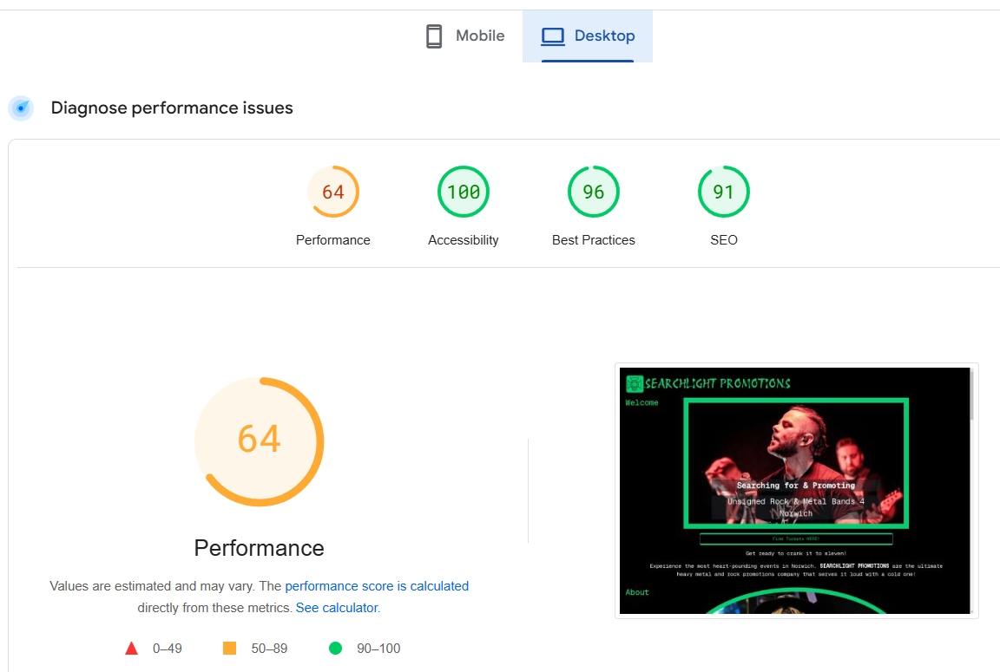
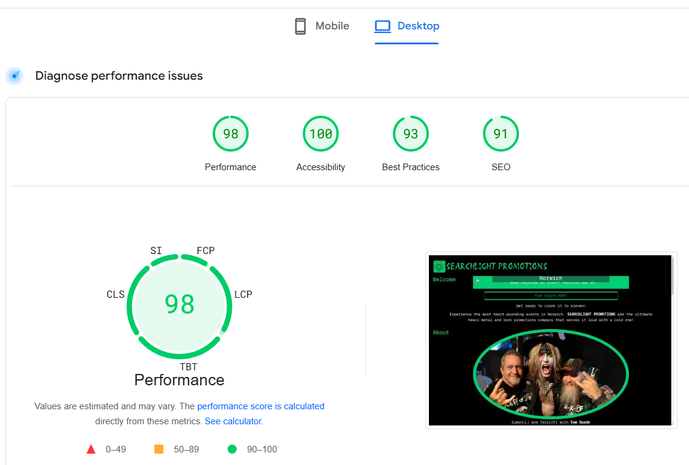

 # Searchlight Promotions
Searchlight Promotions is a live music promotions company that specifically caters to the rock and metal community, in Norwich. It is the combined efforts of two music fans who have over 25 years’ experience in promoting rock and metal bands in East Anglia.

The website serves to increase the company’s visibility on the internet and functions as an additional marketing tool to reach fans and emerging musicians (hitherto known as users) interesting in attending or playing at gigs in Norwich.
--image of site working on all devices--

## 1. Introduction
I approached a fellow metal-head (further referred to as 'the client') who owns a music promotions company in Norwich, and asked if he would like a website as he did not have one, for my first project. They agreed to have one built using the information that they had available on Facebook, for the content of the website, as this was currently his sole marketing platform. 

## 2. Client Brief
The client stipulated the following: 

1.	it must be visually striking, following a colour theme in the style of other rock and metal promotions web sites, but move away from the standard red, black and white colour palette
2.	a very simple site that gives just enough information about the company, but focusses on the events
3.	must scroll (up and down) passed the events when navigating the site
4.	only leaving the site to buy tickets
5.	must not advertise Facebook (or any other social media), but have a link to their Facebook page at the bottom for those that do use Facebook 
6.	must follow the style of Facebook and other social media platforms, using a single finger or thumb to scroll
7.	must be easily navigable without the use of additional “clicking on menus” (the Client)

## 3. The Aim and Purpose of the Site
The primary aim is to create a presence beyond the scope of social media to attract rock and metal fans, as well as emerging new rock and metal musicians, to current events happening in Norwich encouraging contact via email.

The purpose of the site is to showcase upcoming events and to boost ticket sales for each of the gigs by attracting rock and metal fans who don't necessarily use social media. Further, the site must reflect the promotional element of the business to attract unsigned rock and metal artists who would like to get in contact with the company for promotion in Norwich. 

## 4. Goals
To create a website that:
1.	looks visually striking in line with current marketing material
2.	uses a colour palette that reflects the rock and metal community, but moves away from the standard red, black and white themes used on other sites
3.	creates a form that encourages contact from fans who may like additional information as well as encourages contact from potential bands who would like to be promoted in and around Norwich 
4.	shows a clear and simple guide to what is on offer
5.	encourage contact via email
6.	smooth scrolling using the ‘single’ digit’ principle
7.	fully responsive across all devises

## 5. Planning and Development
### 1. Target Audience
  1. aging demographic of rock and metal fans (also known as users) who don’t rely on social media for gig information in Norwich
  2. younger rock and metal fans looking to support artists, locally
  3. emerging, unsigned rock and metal musicians/bands looking to be promoted in Norwich
  4. other music promoters who may want to collaborate

### 2. User Stories
  1. as a fan, I want to find out about gigs that are happening in Norwich (must-have)
  2. a fan, I want to be able to find the information about gigs easily (must-have)
  3. as a fan, I want to be able to identify with the promoters as fellow rock and metal-heads (must-have)
  4. as a fan, I want to be able to contact the promoters to find out when a band is playing, if not already advertised (must-have)

  5. as a musician, I want to see that the company is legitimate (must-have)
  6. as a musician, I want to be able to contact the promoters to discuss playing in Norwich (must-have)
  7. as a musician, I want to be able to link my gigs in Norwich to my social media platforms for marketing purposes (could-have)

  8. as a user, I want high quality images that engaging me (must-have)
  9. as a user, I want to feel a sense of community (should-have)
  10. as a user, I want to have a positive emotional experience (should-have)
  11. as a user, I want to be able to sign up to a mailing list so that I can stay informed (could-have)

## 6. Wire Frames
The wireframes served as a guide throughout the design of the website. They allowed for collaboration with the client when initially discussing the layout and functionality. Below are images to each of the different layouts for mobile, tablet and desktop devices. 

There was some deviation from the original wireframes as the project developed. Initially, I had included a navbar, but at the clients request it was changed to a header instead. 

  #### 1. Desk Top:

  
  
  
     
  
  #### 2. Mobile:
  
  

## 7. Features
 ### 1.	Header
 Was originally intended as a navbar. However, the client did not want any user to “click away from the content” (the client), but rather use the same functionality of the ‘single digit scroll’ as employed by other social media platforms.

  Instead, the logo was incorporated as the header and then later used in the footer to conclude the page.

 ### 2.	Logo
 The logo was designed to show a spotlight with the ‘metal-horns’ inside, centre. Although not visible in the header unless ‘zoomed-in’, it is visible in scaled versions on the thank you and error Messages page.  The logo has now been incorporated in other marketing materials. After discussions with the client they decided on the second of these images for future use, but agrred that the first one was used for contrast in the header and footer:

  1.
  

  2.
  

 ### 3. Colour Scheme
 The colour scheme was designed inline with the 'accepted' tri-colour scheme of most rock and metal websites. However, it must be noted that there is now a trnd developing beyond this to using different and more colours; must usually neon yellow in the style of 'danger' and 'crime-scene' warning tape found in the real world. The choice of backgroumnd colour was always going to black, but the colour green (#11ED73) was picked using a colour picker taking the colour from the original business card image supplioed by the client:

 ### 4.	Typography
  Two fonts were used for the typography of the site:
   1.	The first being "Protest Revolution" chosen to represent a rock and metal genre in #11ED73.
   2.	The second choice was "Geist Mono". This was chosen to create an over-all appeal of an old-school type face and both white and #11ED73 were used for content.

 ### 5.	Call to Action Buttons (cta-btns)
 Were styled to match the colour scheme of the website and not overwhelm the user’s experience with. 
 
 There are two different cta-btns:
  1.	Two general long cta-btns were used; one under the carousel and the other under the about section. Both of which would take the use to the Searchlight Promotions listings page at WeGotTickets.com, and
  2.	Eight smaller cta-btns that direct the user to each event’s ticket listing on WeGotTickets.com
     
       

 ### 6.	Carousel
 Showcases 3 images of artists with the titles that promote the purpose of the business, all separated by 3 posters of the upcoming festival: ROXOFF 25, with the confirmed artists. The 3 images all had the title: Searching for & Promoting - Unsigned Rock & Metal Bands 4 Norwich. All of which have padding in line with the colour theme.

  #### 1. The Dead Reynolds

  #### 2. Black Lakes

  #### 3. Trash Munroe

  #### 4. ROXOFF 25

 ### 7.	Page Titles
 Simple page titles that allow a user to know where they are on the website. I designed them offset to the left as you would find them on a note pad.

 This is an example of the page titles:
 
 
 
 ### 8.	Welcome
 A simple title to let the user know that they have been invited and welcomed to the site that sits alongside the carousel images (see above).

 ### 9.	About
 The title indicates a section of the website design for the users to get to know the business owners, how it all came into being and planned future developments. The about image was chosen to encapsulate the energy of the company with both owners enjoying themselves with the lead singer of an American touring band: The Midnight Devils, with padding and title: 

 

 ### 10.	Events
 The title indicates the section of the web page where the users can find out what gigs have been planned and how to get tickets. All event card images are current marketing image posters used on Facebook and other marketing media. Their size is not consistent, but it was more important to keep the material consistent than to resize the images. Thus, the event cards were set to the end of the column to create some cohesion for the viewing experience, placing the cta-btns in-line with each other.
 

 ### 11.	Contact
 The contact form was set to be in-line with all other content. This allowed for greater sizing of each element considering the aging demographic who may not be as proficient as the younger users’ typing skills.

 

  The contact form has been designed to be simple. It contains four required fields, a non-required filed, a submit button, link to the client's Facebook page and WeGotTickets page:
    1.	First Name (require),
    2.	Last Name (required),
    3.	Email address (require) and'
    4.	Message (required)
    5. There is an optional element for a phone number if the user wishes to be contacted by phone with a placeholder message to indicate how the number should be inputted.
    6. Once submitted the user is directed to a Thank You Message.

 ### 12.	Thank You Message
 The thank you message follows the design and style of the site; however, the logo is larger to show the ‘metal-horns’ which showcases the attention to detail of the company. It also contains a message to direct the user back to the website by closing the window.
 

 ### 13.	Social Media 
 Currently, the only social media that Searchlight Promotions use to advertise their events is on Facebook. No other social media platforms are used. The only other wedsite that hosts their events is on WeGotTickets.com. This highlights the aging demographic’s preferences that typically do not use social media, but do however, remain loyal to Facebook as it was the first social media platform to captivate audiences and has become the only tolerated platform for an aging fan-base (thie reflects the client's, the author's and known fellow rock and metal fans' that we share in common's preferences).

 As the owner specifically requested not to advertise Facebook with any iconography, a simple button was used to direct a user to their Facebook page that remained consistent with the styling of the page. The vision was to create a website that was preferential to their Facebook page. 
 
 ### 14.	Footer 
 The footer uses the logo as a point of conclusion to the web page as well as a message to advertise the designer and copyright of the site, remaining in the current theme of the site and not diverting to author’s own branding.

 ### 15. 404 Error Message
 ---- 

## 8. Bugs Resolved and Unresolved
This project has been a massive learning curve from the start. Having worked my way through the course material successfully, it wasn't till I started the project did I realise how much I didn't know and needed to learn from the beginning again. Hence, every step of the way caused bugs and errors that needed to be addressed as I went along. 

The first major bug I encounted was with *Git* and *GitHub* itself. I ran into some trouble trying to commit and sync my code. I connected with a few fellow students on *Slack* who said that there seemed to be a few people on *Slack* mentioning that they were having problems with *GitHub* and that perhaps it would be resolved later. I took that as sound advice an carried on coding. 

What I was actually doing was creating a new branch by starting a readme file in *GitHub* itself without committing and syncing my last change on my html file. My readme file was committing ok so I carried on with both my html and readme waiting for *Git* and *GitHub* to fix itself. 

As the problem went on I was starting to get concerned that I was going to lose everything so I went to google and *SlackOverflow* to see if anybody had found an answer. What amazed me on *SlackOverflow* was that the amount of negativity that was being thrown at questions around this issue, with comments like: "if you are asking this question then you shouldn't be a coder", "commit and push/pull are the fundamentals of *Git* - go back a do a course on an introduction" and my whole perspective changed. I went from happily coding and waiting for the problem to be resolved to `'yeah, they are probably right and I should just give up. Who am I trying to convince that I will ever get this'.

My next step was to go to AI (to avoid any more negativity) and searched my problem in *Perplexity*. (I use *Perplexity* over *ChatGBT* because *Perplexity* gives you references and I find them useful to go to the original source for further reading.) This is where I learnt that I had created a new branch with my readme file and that my my changes to my  main branch had not been synced before I started my readme doc.

My next step was to go and raise a ticket with Tutor Support on my LMS. By this time it was the next morning and Tutor Support wasn't available for another hour. I left the ticket and went to work in the hope that I could go back to it during my lunch hour. This did not work as too much time had lapsed and the ticket was closed off. 

In a panic I messaged my my course Facilitator. While I waited for a reply I copied all my code to a *Word* Doc and then merged the two branches. I also open a new code space with my copied code as a fail-safe. The merge seemed to have worked, but in fear of it happening again I continued with my new code space and committed everything again.

**Lesson learnt - commit and sync before doing anything else!**

The following other bugs were identified and resolved (in no particular order)
 + Carousel images weren't loading smoothly - a closing div was incorrectly positioned,
 + Carousel images taking a long time to load - compressed image files,
 + Scaling was not responsive - changed media query breakpoints inline with BootStraps breakpopints,
 + Margins not aligning - added offsets
 + Continued to have problems with readme file creating a branch - fellow student advised me to work in Git rather than GitHub
 

## 9. Testing and Deployment
Deployement was done early following lesson in a Code Institute Soft Ware Development Xourse that stated the importance of early deployment to get a sense of what the website looks like as you develop the code. At the time of writing there had been 193 deployments.

Testing of the website was validated using the W3C Validation tools. The fisrt validation of my html code resulted in 17 errors as seen here:

After correcting the errors the report returned without errors:

However, the validations for the thank you message and the error 404 message were returned without errors:

The first css validation returned 5 errors as shown here:

After correcting the errors the validation return, as follows:

Testing accesibility using Lighthouse at first delivered the following report:

After further compressing the jpg img for the first carousel img corrected this and returned a report with a performance rating of 98, accesibility of 100, best practive of 93 and SEO of 91:

## 10. Future Features
When I sent the finalised site to the client it was enthusiastically received and much discussion was had about what else could be implimented in the very near future and before its offical launch.
The following list of items will be used for the final product:
 1. Unique URL - for distribution and marketing pruposes
 2. Navbar - it was agreed that a navbar would be useful for navigation purposes to enable users to find the different areas of the website with ease and to remove a sense of "over load" (the author),
 3. A page solely for ROXOFF 25 - with video links and bios for each of the artists performing at the festival next year
 4. A page solely for merchandice - with images and prices for different items and links to a payment method (yet to be discussed and once I have learnt how to impliment it)

## 11. Credits
This project could not have been possible without the support of the following people:

+ Julia Brown  - my loving partner who took over the reigns at home and kept me fed and watered throughout,
+ Richard Wells - Code Institute Mentor - who helped guide me through the process from start to finish, and by no means least
+ My team mates on my course - Steve Powell, Robert Lewis and Jordan (surname unknown) who agreed to form a weekly study group on a Sunday evening, giving us time to discuss different aspects of our projects as we went along.

The following media was used:

+ Google Fonts - for typology
+ Coolors.co - for the colour picker
+ W3schools - a constant source of reference for all html, css and BootStrap explanations
+ BootStrap Docs - for reference to all BootStrap syntax
+ Images - all supplied by Searchlight Promotions
+ Optimizilla - for image compression
+ W3C Markup Validation Service - for html validation
+ W3C CSS Validation Service - for css validation
+ Lighthouse - for performance and accessibility testing
+ Perplexity - AI tool used for general queries and learning
+ Slack Overflow - for general queries

     
